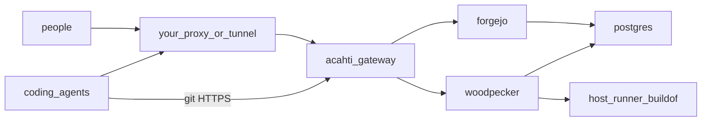

# Acahti

Self-hosted control plane for coding agents. One install: git, required-green checks, language packages, **one MCP**. People sign in with a password; agents use OAuth.

Kernels are official **Forgejo** and **Woodpecker** images. This repo is the gateway, compose, and install contract. Do not fork those UIs.

Pinned versions live in [versions.env](versions.env) (`ACAHTI_VERSION` is this repo). Source of truth: **GitHub `lpythu/acahti`**, branch **`main` only**. A tag `vX.Y.Z` (must match `ACAHTI_VERSION`) is what deploys the acahti host. Never `compose down -v`.

## Architecture



Gateway is the only HTTP app this repo starts. Bind is `GATEWAY_BIND` (default `127.0.0.1:8080`). TLS and the public hostname are **out of tree**: point your reverse proxy or tunnel at that bind and set `ROOT_URL` / `DOMAIN` to the public URL. Public identity is **Acahti**: SPA, MCP, `/acahti/v1`, git HTTPS, and `/api/packages`. Forgejo and Woodpecker stay on the compose network (plus loopback for setup). `/ci` and Forgejo HTML (`/login/oauth`, `/user/login`, `/api/v1`) are not public. Woodpecker authorize and token refresh use `http://forgejo:3000` only — never `ROOT_URL`. `WOODPECKER_HOST` is `http://localhost:8000/ci`. Every `up.sh` re-binds that session.

## Host roles

| Role | Runs |
|---|---|
| **acahti** | gateway, Forgejo, Woodpecker server, one Postgres. GitHub Actions self-hosted runner for **this** repo (tag → `up.sh`). No Woodpecker agent. |
| **buildof** | one `woodpecker-agent` with `ROLE=both` (`build=true,deploy=true`) for acahti product repos |

Product repos **on this island** declare pipelines in `.acahti/pipelines/` and knobs in `.acahti/repo.env`. The host runner on buildof executes [runner/](runner/) (`run.sh` → `ci.sh` / `cd.sh` / `pkg.sh`). `ssh office` / `ssh thk` only appear inside `runner/kube.sh`. Product branches stay `dev` / `test`.

**This repo** (acahti itself): `main` only. Release: bump `ACAHTI_VERSION`, `git push origin main`, `bash scripts/tag-release.sh` → tag `v$ACAHTI_VERSION` → GitHub Actions on the **acahti** machine → `scripts/up.sh` (compose + configure).

## Install contract (for an agent)

Chicken and egg: the laptop agent SSHs to an empty host and follows this list. Do not ask a human to click through UIs. Scripts are non-interactive.

1. Probe with `bash scripts/detect.sh`. Stop if no sudo or memory &lt; 2G.
2. Set `DOMAIN` and `ROOT_URL`. Optional: `ACAHTI_ORG`, `ACAHTI_BUILD` (SSH spec for buildof, `ROLE=both`). Laptop or no proxy: `GATEWAY_BIND=0.0.0.0:8080`.
3. Put your reverse proxy or tunnel in front of `GATEWAY_BIND` (default `127.0.0.1:8080`). This repo does not ship Caddy or cloudflared.
4. On the acahti host, as a sudoer: `bash scripts/install.sh`.
   - `bootstrap.sh` — Docker, `/var/lib/acahti/{forgejo,woodpecker,postgres,gateway}`
   - `up.sh` — `compose up` (never `down -v`), then `configure.sh`
   - `configure.sh` — admin, org, Woodpecker↔Forgejo OAuth on the compose net, gateway tokens
   - if `ACAHTI_BUILD` is set, SSH-install one `ROLE=both` agent on that host
5. Print the Use contract (same two lines as `/`, `/skill.md`, and README Usage). On failure stop and return logs; do not leave a half install.

gRPC is published as `WOODPECKER_GRPC_PUBLISH` (default `127.0.0.1:9000`). With `ACAHTI_BUILD`, install binds the LAN IP. Do not publish it to the internet (`lan` or `ssh-reverse`).

Skills: [skills/acahti-install/SKILL.md](skills/acahti-install/SKILL.md) (stand up acahti) and the live `GET /skill.md` (use after it is up).

## Web preview

Do not tag to look at UI. `scripts/web-dev.sh` proxies `/ui` to the host `:8080` (`192.168.0.180` or Tailscale). Not `acahti.saidc.ai` (Cloudflare).

```bash
bash scripts/web-dev.sh
# http://127.0.0.1:5173  — log in with an acahti account
```

Override: `ACAHTI_DEV_ORIGIN=http://192.168.0.180:8080 bash scripts/web-dev.sh`. Confirm locally, then bump `ACAHTI_VERSION` and `bash scripts/tag-release.sh`.

## Usage

```text
Install https://acahti.example.com/skill.md
Join    https://acahti.example.com/join     (invite from an admin)
```

Give the first line to any coding agent. It pulls this acahti’s skill, connects `$ROOT_URL/mcp`, and completes OAuth. If the browser has no account, open the second line with an admin invite and pick a username and password; existing accounts use `/login`. Then `whoami` and set `--local` git identity only when the remote host is acahti.

- Git HTTPS: `https://acahti.example.com/acme/<repo>.git` — username `whoami.login`, password is the OAuth `access_token` the client already holds. SSH optional: `ssh://git@$DOMAIN:2222/acme/<repo>.git`
- Packages: `https://acahti.example.com/api/packages/acme/pypi/simple/` and `…/npm/`
- REST: `/acahti/v1/…` same verbs as MCP
- Not public: Woodpecker `/ci`, Forgejo UI, Forgejo `/api/v1`
- Acahti upgrade: tag `vX.Y.Z` on `lpythu/acahti` (not a push to `main`)

Examples use `https://acahti.example.com`. Do not hard-code a live acahti hostname.

## Data

Bind-mount `${ACAHTI_DATA:-/var/lib/acahti}` only. After data exists, never `compose down -v` and never prune named volumes on that host.

## Versions

See [versions.env](versions.env). Tag acahti as `v$ACAHTI_VERSION`. Woodpecker server and every host agent must share the same train (gRPC rejects a mix). Gateway is a Go static binary, memory cap 256M.
