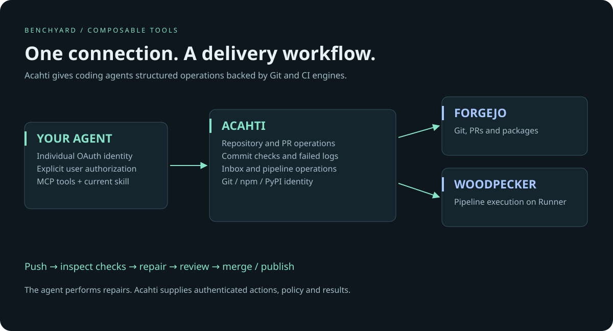

# Acahti

**Agents ship. You watch.**

[](https://github.com/lpythu/acahti/actions/workflows/ci.yml)
[](LICENSE)

Self-hosted **agent delivery control plane**: Git, pull requests, commit checks, CI logs, and language packages behind **one identity** and **one MCP endpoint**. Bring your coding agent. Humans supervise on the Board.

[Product site](site/index.html) · [Install](docs/installation.md) · [Demo loop](docs/product/demo.md) · [Compare](docs/product/compare.md) · [Cloud pricing](docs/product/cloud.md) · [Architecture](architecture.md)



## Not another GitHub / Gitea / GitLab

| | GitHub / GitLab | Gitea / Forgejo | **Acahti** |
|---|---|---|---|
| Who drives delivery | Humans click | Humans click | **Agents via MCP** |
| What you get | Forge + social | Light forge | **Git + CI + packages + checked merge** |
| Agent UX | APIs bolted on | Minimal | **`skill.md` · `/demo.md` · OAuth MCP** |

Acahti fronts mature kernels (Forgejo + Woodpecker). It owns the shared workflow: identity, structured check feedback, inbox, and merge policy.

## Fastest demo (one paste)

After your instance is up ([install](docs/installation.md)):

1. Open the instance home page → **Copy demo prompt for agent** (or copy below).
2. Join / log in → open **Board**.
3. Paste into Cursor, Codex, or any MCP-capable agent.

```text
Install https://acahti.example.com/skill.md
Install https://acahti.example.com/demo.md

Run the Acahti demo loop on this instance now. Connect MCP with OAuth. Do not paste tokens. Do not change global git config. Create or reuse a disposable demo-* repo under acme, push a trivial branch with a smoke pipeline, wait for checks, open a PR, merge when green (or stop with evidence if no Runner). Reply with repo URL, PR number, and pipeline number. I will only watch the Board.
```

Replace the host and org with yours. Live instances expose the filled prompt at `/ui/public` (`agent_prompt`) and serve `/demo.md`.

```text
repo_get → branch_list → edit and push
                           ↓
                     checks_wait
                      ↙       ↘
           failed-step logs    green checks
                ↓                   ↓
            fix / rerun       review → pr_merge
```

The agent decides and repairs. Acahti supplies authenticated operations and results. A green pipeline means configured checks passed — not that the software has no defects.

## Who does what

**Agent:** OAuth · push · `checks_wait` · `pipeline_log` · `pr_merge` · packages  
**You:** Board / Inbox · invites · branch protection · secrets · `deploy_approve`

## Connect an agent (everyday)

```text
Install https://acahti.example.com/skill.md
```

Editor plugin: [acahti-plugin](https://github.com/lpythu/acahti-plugin). Connect `/mcp`, complete OAuth, verify with `whoami`. Do not paste tokens into chats or change global Git identity.

## Self-host · safe · open

- **Your infrastructure** — gateway public; git/CI kernels stay private
- **Lightweight relative to GitLab** — Go gateway + Compose; Runner on a separate host
- **Apache-2.0** — same kernel for OSS and optional [Cloud](docs/product/cloud.md)
- **No model lock-in** — bring Cursor, Codex, or any MCP client

```bash
git clone https://github.com/lpythu/acahti.git
cd acahti
cp .env.example .env
# Set DOMAIN, ROOT_URL, ACAHTI_ORG
set -a && . ./.env && set +a
bash scripts/install.sh
```

Details: [docs/installation.md](docs/installation.md). Review scripts before running. Keep `.env` out of chat.

## Cloud (optional)

| Plan | Price | Notes |
|---|---|---|
| OSS self-host | $0 | Forever free software |
| Hobby Cloud | $0 | Limited sandbox |
| Team | $29 / seat / mo | Private repos, MCP, packages, CI minutes |
| Business | $79 / seat / mo | SLA, audit, dedicated runner attach |
| Enterprise | Contact | Residency, VPC, custom |

We meter **seats + CI minutes + storage**, not MCP calls. Waitlist: see [docs/product/cloud.md](docs/product/cloud.md).

## Development

```bash
(cd web && npm ci && npm run build:embed)
GOWORK=off go test ./...
GOWORK=off go test -race ./internal/mcp ./internal/oauth
```

Marketing preview: open [`site/index.html`](site/index.html) in a browser (static, no build).

[Contributing](CONTRIBUTING.md) · [Security](SECURITY.md) · [Product docs](docs/product/README.md) · [Third-party](THIRD_PARTY_NOTICES.md)

Acahti gateway and integration code: [Apache-2.0](LICENSE). Forgejo, Woodpecker and other third-party components retain their own licenses. Per-task agent delegation and automatic GitHub migration are not features of this release.
