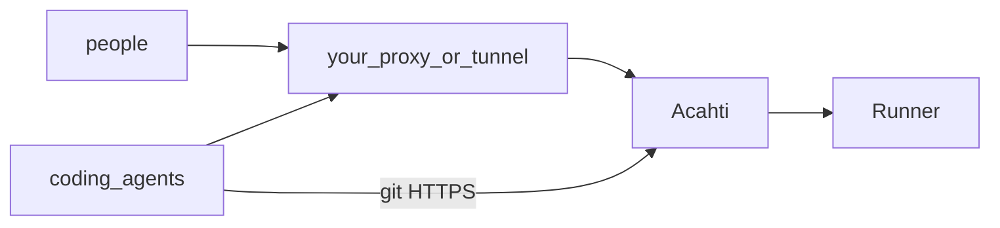

# Acahti

Self-hosted control plane for coding agents. One install: git, required-green checks, language packages, **one MCP**. People sign in with a password; agents use OAuth.

Pinned versions live in [versions.env](versions.env) (`ACAHTI_VERSION` is this repo). Source of truth: **GitHub `lpythu/acahti`**, branch **`main` only**. A tag `vX.Y.Z` (must match `ACAHTI_VERSION`) is what deploys the acahti host. Never `compose down -v`.

## Architecture

See [architecture.md](architecture.md) for the current stack, **identity vs pipeline secrets**, org and pipeline read models, and page contracts. See [pipes.md](pipes.md) for official pipeline pipes (`pipe: helm@v1`). Git, npm, and pypi use one Acahti login. Pipeline secrets are island-external only.



Gateway is the only HTTP app this repo starts. Bind is `GATEWAY_BIND` (default `127.0.0.1:8080`). TLS and the public hostname are **out of tree**: point your reverse proxy or tunnel at that bind and set `ROOT_URL` / `DOMAIN` to the public URL. Public identity is **Acahti**: SPA, MCP, `/acahti/v1`, git HTTPS, `/api/packages`, pipelines, Runner.

## Host roles

| Role | Runs |
|---|---|
| **Acahti** | control plane (git, pipelines, UI, MCP, packages) |
| **Runner** | executes `.acahti/pipelines/` (`ACAHTI_BUILD` SSH spec). Official pipes (`acahti-pipe`) plus host tools and credentials |

Repos declare pipelines in `.acahti/pipelines/`. Steps call official **pipes** (`pipe: helm@v1`) or raw `commands:`. Acahti expands `pipe:` before the Runner executes. Catalog: [pipes.md](pipes.md).

**This repo** (acahti itself): `main` only. Release: bump `ACAHTI_VERSION`, `git push origin main`, `bash scripts/tag-release.sh` → tag `v$ACAHTI_VERSION` → GitHub Actions on the **acahti** machine → `scripts/up.sh` (compose + configure + refresh Runner pipes on `ACAHTI_BUILD`).

## Install contract (for an agent)

Chicken and egg: the laptop agent SSHs to an empty host and follows this list. Do not ask a human to click through UIs. Scripts are non-interactive.

1. Probe with `bash scripts/detect.sh`. Stop if no sudo or memory &lt; 2G.
2. Set `DOMAIN` and `ROOT_URL`. Optional: `ACAHTI_ORG`, `ACAHTI_BUILD` (SSH spec for the Runner, `ROLE=both`). Laptop or no proxy: `GATEWAY_BIND=0.0.0.0:8080`.
3. Put your reverse proxy or tunnel in front of `GATEWAY_BIND` (default `127.0.0.1:8080`). This repo does not ship Caddy or cloudflared.
4. On the acahti host, as a sudoer: `bash scripts/install.sh`.
   - `bootstrap.sh` — Docker, `/var/lib/acahti/{forgejo,woodpecker,postgres,gateway}`
   - `up.sh` — `compose up` (never `down -v`), then `configure.sh`
   - `configure.sh` — admin, org, compose-net OAuth, gateway tokens
   - if `ACAHTI_BUILD` is set, SSH-install one Runner (`ROLE=both`) on that host
5. Print the Use contract (same two lines as `/`, `/skill.md`, and README Usage). On failure stop and return logs; do not leave a half install.

gRPC is published as `WOODPECKER_GRPC_PUBLISH` (default `127.0.0.1:9000`). With `ACAHTI_BUILD`, install binds the LAN IP. Do not publish it to the internet (`lan` or `ssh-reverse`).

Skills: [skills/acahti-install/SKILL.md](skills/acahti-install/SKILL.md) (stand up acahti) and the live `GET /skill.md` (use after it is up).

## Web preview

Do not tag to look at UI. Local Vite HMR proxies `/ui` to the host `:8080`. Confirm there, then bump `ACAHTI_VERSION` and `bash scripts/tag-release.sh`.

## Usage

```text
Install https://acahti.example.com/skill.md
Join    https://acahti.example.com/join     (invite from an admin)
```

Give the first line to any coding agent. It GET `$ROOT_URL/skill.md` this turn, connects `$ROOT_URL/mcp`, and completes OAuth. If the browser has no account, open the second line with an admin invite and pick a username and password; existing accounts use `/login`. Then `whoami` and set `--local` git identity when any remote host is acahti.

Plugins: [lpythu/acahti-plugin](https://github.com/lpythu/acahti-plugin) (`cursor/` for Cursor, `codex/` for Codex). Do not put `acahti` in `~/.cursor/mcp.json`.

- Git: `https://acahti.example.com/acme/<repo>.git` — username is the Acahti login; password is the account password (same as `/login`) or the OAuth `access_token` the MCP client already holds
- Packages: same credentials as git — `https://acahti.example.com/api/packages/acme/pypi/simple/` and `…/npm/`. CI uses the triggering user's identity (`docker-build` / publish inject it). Do not add an npm or publish token.
- REST: `/acahti/v1/…` same verbs as MCP
- Not public: `/ci` and git-kernel HTML (`/login/oauth`, `/user/login`, `/api/v1`)
- Acahti upgrade: tag `vX.Y.Z` on `lpythu/acahti` (not a push to `main`)

Examples use `https://acahti.example.com`. Do not hard-code a live acahti hostname.

## Data

Bind-mount `${ACAHTI_DATA:-/var/lib/acahti}` only. After data exists, never `compose down -v` and never prune named volumes on that host.

## Versions

See [versions.env](versions.env). Tag acahti as `v$ACAHTI_VERSION`. The control plane and every Runner must share the same train. Gateway is a Go static binary, memory cap 256M.

### MCP transport

The gateway uses the official Go MCP SDK with stateless Streamable HTTP and JSON responses at `/mcp`. Each request authenticates independently using the member's OAuth bearer token. GET streaming and transport sessions are not enabled. Cross-origin browser requests are rejected; native MCP clients do not need an Origin header.

Before release, run `GOWORK=off go test ./...` and `GOWORK=off go test -race ./internal/mcp ./internal/oauth`. Acceptance requires a real client to complete initialization, list tools, and call `whoami` with the expected individual identity; a completed OAuth redirect alone is not a connection check.
