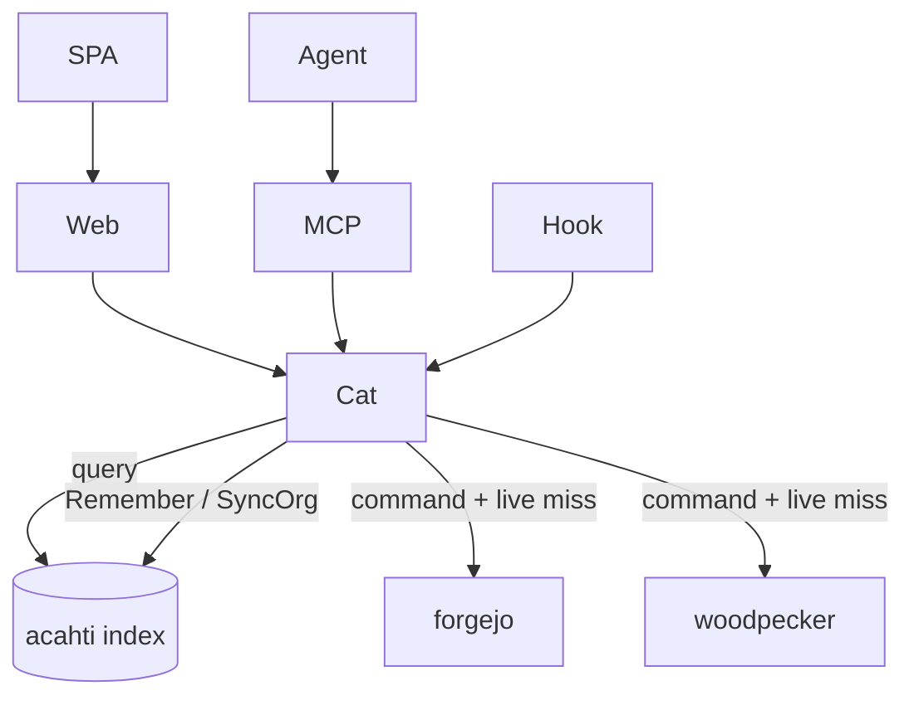
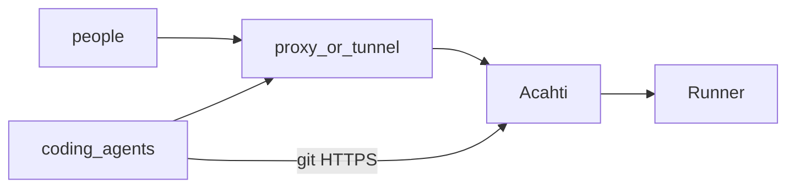
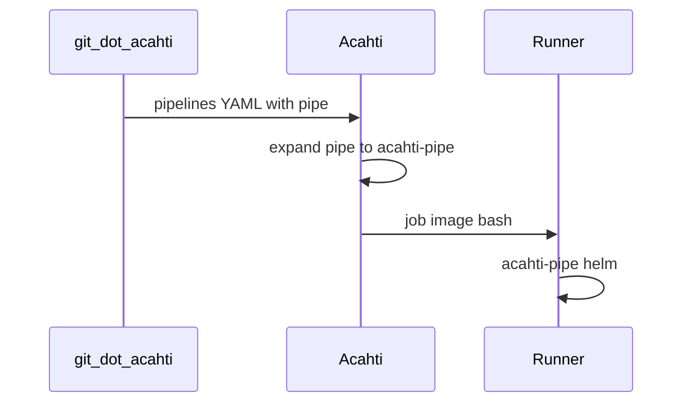
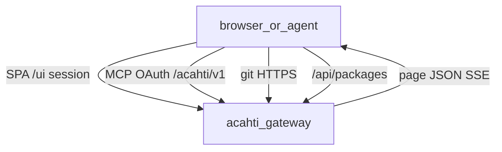
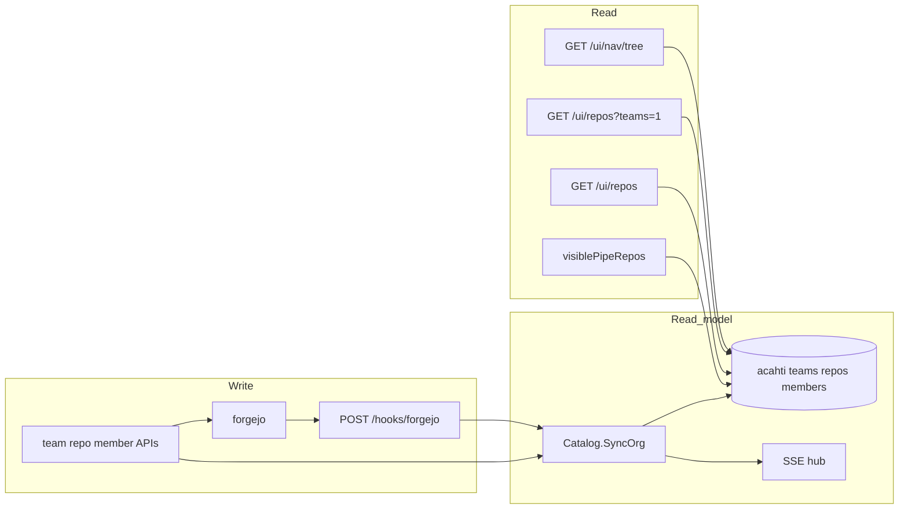
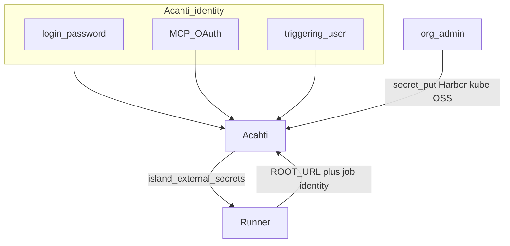
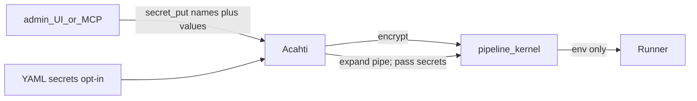
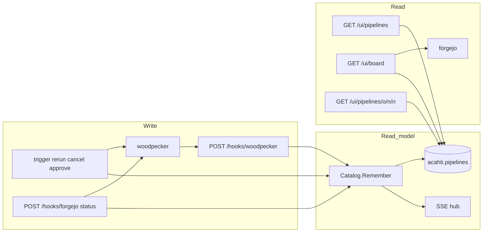
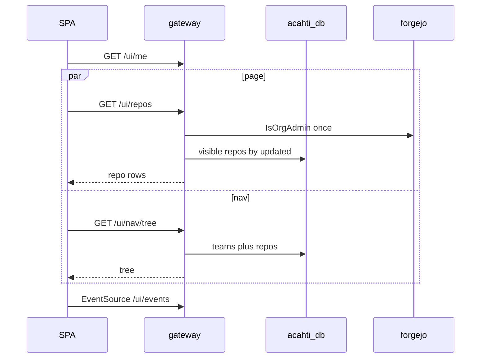

# Acahti architecture

Gateway is the only public HTTP app. People and coding agents never call internal kernels.

UI reads are a **read/write split** (local read models, not a Postgres replica):

| Surface | Read | Write |
|---|---|---|
| Pipeline runs | `acahti.pipelines` | pipeline kernel + webhook / mutation / backfill |
| Board heatmap | `user_heatmap` | Forgejo `/users/{login}/heatmap` via `RememberHeat` and startup backfill |
| Teams, repos, members, nav, ACL | `acahti` teams / repos / members | Acahti mutation write-through + git webhook + startup reconcile |
| Git contents, commits, PRs, packages, step logs | live kernel | those objects live in the kernel |

## Code rule (CQRS facade)

`catalog.Catalog` is the **only** application face for Forgejo and Woodpecker. `web`, `mcp`, `api`, and hooks must not hold or call `forgejo.Client` / `woodpecker.Client`.



**Query**

1. Indexed? → `store` (+ short TTL memo for queue paint).
2. Live whitelist miss → kernel GET via Catalog (optional write-back `Remember`).
3. Else empty page / NotFound. Do not Walk kernels to assemble list, board, sidebar, or visibility.

**Command**

1. ACL / Ready.
2. Kernel mutate.
3. `Remember` or org upsert / SyncOrg.
4. `Notify` (SSE).
5. Return `Present(...)` shape.

Live whitelist (GET kernel, still through Catalog): git contents / commits / diff / branches / tags / PR detail / packages / statuses; CI detail miss or in-flight refresh, step log, `QueueInfo`, agents.

Kernel HTTP transport is shared `internal/httpx` (timeouts, JSON, SoftFail). Domain clients stay in `internal/forgejo` and `internal/woodpecker`.

The git kernel remains the source of git objects, PRs, packages, and `.acahti/pipelines/` YAML on a **write or detail miss**. Gateway does not Walk the git kernel to assemble list, board, sidebar, or visibility.

## Stack



| Host | Runs |
|---|---|
| **Acahti** | control plane. No Runner on this host. |
| **Runner** | `ACAHTI_BUILD` — executes `.acahti/pipelines/` after Acahti expands `pipe:`. One `woodpecker-agent`. `WOODPECKER_MAX_WORKFLOWS` is host-derived (`nproc` / memory) unless pinned in the agent env. Jobs in one pipeline follow YAML `depends_on` (CI then CD then e2e). Excess workflows stay in the Woodpecker queue (`pending` / `waiting_on_deps`). |

Public identity is Acahti: SPA, MCP, `/acahti/v1`, git HTTPS, `/api/packages`. Closed to the internet: `/ci`, git-kernel HTML, `/api/v1`.

## Pipes

A pipeline file in `.acahti/pipelines/` is a **job**. A **pipeline** run contains those jobs; each job has **steps**. A **pipe** is an official reusable step (`pipe: helm@v1` + `with:`). **Expand** is Acahti’s pre-run YAML rewrite: `pipe:` becomes `acahti-pipe`, island-external `secrets:` maps become env, and `docker-build` / publish receive the triggering user’s identity (`ACAHTI_USER` / `ACAHTI_TOKEN`). Harbor and ACR are not auto-injected — YAML must name them. The Runner then runs `acahti-pipe`. See [pipes.md](pipes.md).



## Public surface



| Path | Who | Backend |
|---|---|---|
| `/ui/*` | people (cookie) | catalog BFF |
| `/mcp`, `/acahti/v1` | agents (OAuth) | same catalog |
| `/{org}/{repo}.git` | git | reverse proxy → git kernel (`X-WebAuth-User`) |
| `/api/packages/*` | package clients | same identity proxy as git HTTPS → git kernel |
| `/hooks/*` | kernels | index upsert + SSE |
| `/api/v1/*`, `/ci/*` | — | 404 |

SPA and MCP share one `catalog.Catalog`. The browser does not assemble a page from kernel APIs.

## Org catalog read / write



A **team folder** (`team_repos`) is grouping in the nav. Git and UI visibility is a per-repo ACL: `repo_collaborators` ∪ `team_repos.granted`. Joining a team does not open every repo in that folder.

**Write**

1. Create/delete team, members → Forgejo, then upsert the index, publish `catalog.updated`. Move/attach repo only writes the folder row (`granted` stays false until Access grants it).
2. Access `PUT /ui/repos/{owner}/{name}/grant` sets `team_repos.granted` and Forgejo `AddTeamRepo` / `RemoveTeamRepo` for that one repo. Direct people stay `repo_collaborators`.
3. MCP `repo_create` upserts `repos` (and a folder `team_repos` if a team is set).
4. Forgejo `repository` / create / delete webhooks upsert or delete the repo row.
5. Startup **reconcile** walks org teams, members, collaborators, and team-repos. Folder links already in the index are kept. Forgejo team-repos that are not `granted` are removed so git matches the index; granted rows are `AddTeamRepo`d again. Then `ReplaceOrg`.

**Read**

- `GET /ui/nav/tree`, `GET /ui/repos?teams=1`, `GET /ui/repos`, `GET /ui/teams/{team}` members/repos, pipeline ACL: SQL only. Visible repos are direct collab or a `granted` team.
- `GET /ui/users` attaches this page’s `teams` and `repos` ACL (`UserRepoPermsMany`); the Users Repos menu does not N+1.
- Repo file browser / commits / PRs still `GetRepo` (git ACL + live metadata). Team label comes from `team_repos`.
- `IsOrgAdmin` still checks Forgejo Owners (memo 30s).

## Identity, packages, and pipeline secrets

One Acahti identity. Git and packages share `$ROOT_URL` and the same credentials. Pipeline secrets are only for island-external systems (Harbor/ACR, kubeconfig, OSS, argos, Codeup git). People and agents use their login; a CI job uses **the user who triggered that run**.



| | What | Who holds it | How we say it |
|--|--------|--------|------------|
| **Acahti identity** | login + password, or MCP `access_token`. CI = job identity (same pair as clone; pipes inject it) | person, agent, running job | same as git. No PAT, no second name |
| **Pipeline secrets** | Harbor/ACR, kubeconfig, OSS, argos, `codeup_netrc` | org / repo; repo sees the effective set | Org secrets / Repo secrets. Not identity |

Same secret name: **repo overrides org**. YAML `secrets:` only names which secret a step uses.

| Who | git / npm / pypi | Harbor / kube / OSS |
|----|------------------|---------------------|
| person / agent | Acahti login + password or OAuth | do not read pipeline secrets to install packages |
| CI | job identity, injected by `docker-build` / publish | YAML names them (`DOCKER_PASSWORD: harbor_password`, `KUBECONFIG: kubeconfig_office`) |

Packages live at `$ROOT_URL/api/packages/$ORG/{npm\|pypi}` and use the same identity proxy as git HTTPS. Org members who can see repos can install. Publish (`npm-publish-acahti` / `pypi-publish-acahti` / `pkg_publish`) PUTs to the gateway LAN bind (`WOODPECKER_SERVER` host `:8080`) with `Host` = `ROOT_URL` — not through the public tunnel. `docker-build` writes job identity as BuildKit secrets `id=npmrc` (HTTP Basic `username` + base64 `_password`) and `id=netrc`, then `docker buildx --network=host`. Repo `.npmrc` / `[[tool.uv.index]]` name the registry only. App Dockerfiles mount `id=npmrc` at `/root/.npmrc` and `id=netrc` at `/root/.netrc` on install `RUN`s; they do not set `--network=host` and they do not mount raw username/password.

Harbor (office) and ACR (hk) are a pair of **user** registries. YAML names the host, username, and password. Do not auto-inject either. Image names (`BASE_IMAGE=…`) live in product YAML. HTTP vs HTTPS is `docker-login` `http: true` (or `registry: http://host`) — Acahti has no registry hostname. `buildx --config` is create-time on the shared `acahti` builder; the login pipe merges YAML-declared HTTP hosts into `buildkitd.toml`. Harbor `base` and `library` are anonymous-pull so CI `--pull` needs no login. Office CD logs in to Harbor to push products; HK CD logs in to ACR for bases and products.

| Secret | Pipe | YAML |
|--------|------|------|
| triggering user (install/publish Acahti packages) | `docker-build` / `npm-publish-acahti` / `pypi-publish-acahti` | do not write; expand injects it |
| `harbor_username` / `harbor_password` | office `docker-login` | name as `DOCKER_USERNAME` / `DOCKER_PASSWORD` |
| `acr_username` / `acr_password` | hk `docker-login` | same mapping |
| `kubeconfig_office` / `kubeconfig_bj` | `helm` | name as `KUBECONFIG` |
| `argos_dash_url` / `argos_token` | product `argos run --dash` via `uv` | name as `ARGOS_DASH_URL` / `ARGOS_TOKEN` |
| `oss_*` | `oss-put` | name them |
| `codeup_netrc` | still cloning Codeup | name it |
| `npm_token` / `acahti_publish_token` | none | delete |

Laptop / agent installs use the same identity as git. Repo files only name the registry. Credentials stay in `~/.npmrc` / `~/.netrc` or env, not in git. Harbor and ACR library/base images are named only in pipeline YAML (`BASE_IMAGE=harbor.saidc/base/…`).

**npm** (committed `.npmrc` is registry-only):

```
@saidc:registry=https://acahti.saidc.ai/api/packages/saidc/npm/
```

Local `~/.npmrc` (not committed): username = Acahti login; `_password` = **base64** of the login password or MCP `access_token`; `always-auth=true`.

```
//acahti.saidc.ai/api/packages/saidc/npm/:username=YOUR_LOGIN
//acahti.saidc.ai/api/packages/saidc/npm/:_password=BASE64_PASSWORD
always-auth=true
```

CI: YAML does not name npm tokens. Expand injects `ACAHTI_USER` / `ACAHTI_TOKEN` / `ACAHTI_ROOT_URL` / `ACAHTI_ORG`. `docker-build` writes a user-level npmrc secret. Dockerfile `COPY .npmrc` (registry only) then `RUN --mount=type=secret,id=npmrc,target=/root/.npmrc` around `pnpm install`. Auth never enters a committed file or an image layer.

**PyPI** (committed `pyproject.toml` is the index URL):

```toml
[[tool.uv.index]]
name = "saidc"
url = "https://acahti.saidc.ai/api/packages/saidc/pypi/simple/"
authenticate = "always"
```

Local env: `UV_INDEX_SAIDC_USERNAME` / `UV_INDEX_SAIDC_PASSWORD` (raw password, not base64), or `~/.netrc`:

```
machine acahti.saidc.ai
login YOUR_LOGIN
password YOUR_PASSWORD_OR_MCP_TOKEN
```

CI: `docker-build` writes a netrc secret. Dockerfile `RUN --mount=type=secret,id=netrc,target=/root/.netrc` then `uv sync`. No `.netrc` in the build context.

## Pipeline secrets

Secrets live on Acahti (SPA + MCP). The pipeline kernel encrypts values and injects them as env at job time. Acahti never stores values. The Runner has no credential files.



**Write**

1. Org Owners: `/admin/secrets` or `secret_put` `{scope: org}`.
2. Repo admins: `/repos/{owner}/{name}/secrets` or `secret_put` `{scope: repo, repo}`.
3. Non-admins get **404** (no tab, no names). Values are never returned, including to admins.

**Run**

YAML `secrets: [name]` or mapped `secrets: { ENV: name }` for island-external secrets. Acahti rewrites maps to `environment.from_secret`. Pipes read env (`DOCKER_PASSWORD`, `KUBECONFIG` document, …). Acahti packages use the triggering user's identity (`ACAHTI_USER` / `ACAHTI_TOKEN`), not a pipeline secret.

In `commands:`, the runner interpolates `${NAME}` from the job context **before** the shell starts. Step `environment:` is not in that pass. Write `$IMAGE`, not `${IMAGE}`.

`GET /ui/repos/{owner}/{name}/secrets` is the effective set (org inherited + repo override). Admin `/admin/secrets` is the org catalog. Repo admins see inherited org names as read-only. Members get 404 and no tab. There is no `secret_get`.

## Pipeline read / write



**Write (command)**

1. SPA/MCP calls trigger / rerun / cancel / approve → Woodpecker.
2. Gateway `Remember`s the pipeline: hydrate kernel jobs, upsert `acahti.pipelines`, publish `pipeline.updated`.
3. Woodpecker progress also arrives as Forgejo `status` webhooks or `POST /hooks/woodpecker`. Same `Remember`.
4. Startup backfill lists Woodpecker runs per active repo and `Remember`s them.
5. `WatchPipelines` refreshes indexed `running` / `pending` **and** Woodpecker queue heads that are not in the index yet (queue paint every 3s; 15m silent-log cancel every 1m). New runs often hit `/api/queue/info` before the hook is ingested, so the watcher `Refresh`es those numbers into `acahti.pipelines`. Queue `wait` / `queue_position` is painted live from `GET /api/queue/info` (not stored). Job skip, `when`, and `depends_on` are Woodpecker’s. After a parent job fails, Woodpecker often leaves the `depends_on` child in the concurrency queue (`pending`) and the pipeline `running` until a worker later skips it; `Refresh` `Cancel`s that leftover so the kernel becomes `failure` / `skipped` immediately. A running step whose log has not grown for 15m is also `Cancel`ed (Woodpecker does not close a step when the process dies without a Done RPC). Every Acahti-initiated cancel writes why onto `pipeline.error` (`canceled by <login>` or `canceled: no new log for 15m on step <name>`) and keeps it across Woodpecker’s empty/`Canceled` reports. List paint merges those queue heads over `LatestByRepo` (so a stale indexed success cannot hide a live run), then annotates wait from the same queue snapshot. `paintPipes` still must not `GetPipeline`.

**Read (query)**

1. `GET /ui/pipelines` — newest run per repo (`created DESC`), optional `status=` (`all` / `failed` / `blocked` / `running` / `success`). Later numbers replace earlier branches and tags. Visibility from the org catalog. In-flight Woodpecker queue heads replace a stale indexed success for that repo. Rows then get live queue paint (no YAML fetch).
2. `GET /ui/repos/{owner}/{name}/pipelines` — that repo’s full run history from the index.
3. Board — open PRs whose head SHA latest indexed pipeline is `success` (ready to merge). Failed and blocked runs live on `/pipelines?status=`.
4. Detail — index row. Miss or in-flight (`running` / `pending` / `blocked`) → Woodpecker `GetPipeline` and write-back. In-flight rows also get `wait` (`queue` / `deps` / `concurrency`) and `queue_position` from the Woodpecker queue. `files[]` loads YAML on `(repo, commit)` cache miss.
5. Step log still hits Woodpecker (`GET …/log`).

## Page contracts

One screen, one JSON. The SPA renders fields; it does not walk kernels.

| Request | Returns |
|---|---|
| `GET /ui/pipelines` | latest run per repo (queue heads win over a stale indexed success); optional `status=`; live queue paint |
| `GET /ui/pipelines?status=` | `failed` / `blocked` / `running` / `success` filters that latest-per-repo set |
| `GET /ui/board` | open PRs whose head SHA latest indexed pipeline is success |
| `GET /ui/repos/{owner}/{name}/pipelines` | that repo’s run history |
| `GET /ui/pipelines/{owner}/{name}/{n}` | `{ pipeline, team, files }` — `pipeline.jobs[].steps`; in-flight `wait` / `queue_position` / `agent` |
| `GET /ui/queue` | Owners: Woodpecker queue snapshot. `stats` counts pipelines (not jobs) that are running or queued. Task lists stay jobs. |
| `GET /ui/agents` | Owners: runners (`capacity`, `running`) plus `queue` |
| `GET /ui/secrets` | Org secrets catalog (Owners) |
| `GET /ui/repos/{owner}/{name}/secrets` | effective set: org inherited + repo override (repo admin) |
| `GET /ui/nav/tree` | `[{ team, repos }]` from the org catalog; trailing `{ team: "" }` is unassigned repos |
| `GET /ui/repos?teams=1` | team names and counts |
| `GET /ui/users` | page of users with `teams` and this page’s `repos` ACL |
| `GET /ui/events` | SSE: `pipeline.updated`, `catalog.updated`, or `forgejo` (PRs). Filtered per user with the same visible-repo ACL as list APIs; `forgejo` is `{ok:true}` only |

MCP `pipeline_list` / `pipeline_get` return the same in-flight `wait` fields. `agent_status` returns runners plus the queue snapshot.



Detail open still may hit Forgejo for YAML files and Woodpecker for a missing row or logs.

Live updates: `pipeline.updated` patches list/detail by `repo+number`. `catalog.updated` reloads the nav tree and repo lists. `forgejo` refreshes board PRs only.

## Why not hit Forgejo or Woodpecker from the browser

Runs live in Woodpecker, not Forgejo. Opening `/api/v1` or `/ci` would break “Acahti is the only public identity” and push N+1 into the browser.

The extra hop `browser → gateway → localhost kernel` is not the cost. The cost was assembling one page with many kernel calls. The indexes and page JSON remove that.

## Data on disk

`${ACAHTI_DATA}` bind mounts only. After data exists, never `compose down -v`.

| Volume | Contents |
|---|---|
| `postgres/` | `forgejo`, `woodpecker`, `acahti` |
| `forgejo/` | git + Forgejo state |
| `woodpecker/` | Woodpecker server state |
| `gateway/` | invites, OAuth clients |

`acahti.pipelines` keys `(repo, number)`. Org catalog: `repos`, `teams`, `team_repos` (folder + `granted`), `team_members`, `repo_collaborators`.

Gateway migrate is `CREATE TABLE IF NOT EXISTS` at process start. Existing hosts: `store.Open` creates database `acahti` if missing (init script only runs on an empty PG data dir).

## Release

This product repo is GitHub `lpythu/acahti`, `main` only. Bump `ACAHTI_VERSION`, push, `bash scripts/tag-release.sh` → tag `v$ACAHTI_VERSION` → host Actions → `scripts/up.sh` (compose + configure + copy `pipes/` onto `ACAHTI_BUILD`). Gateway image builds with `-mod=vendor` (the acahti host cannot reach `proxy.golang.org`).
