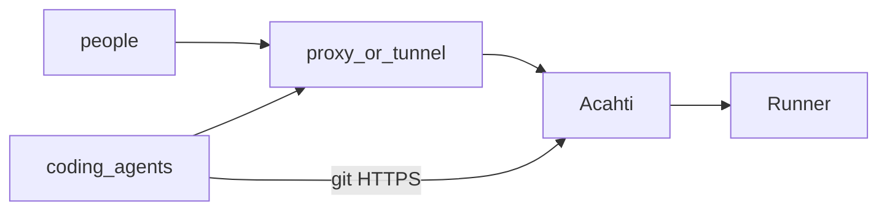
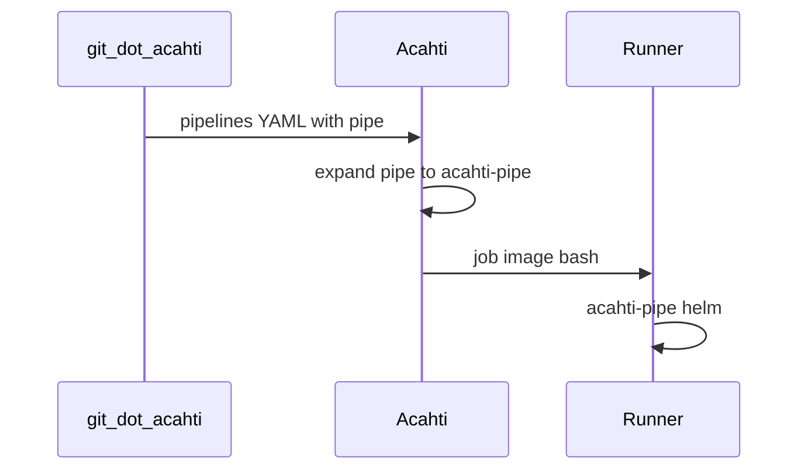
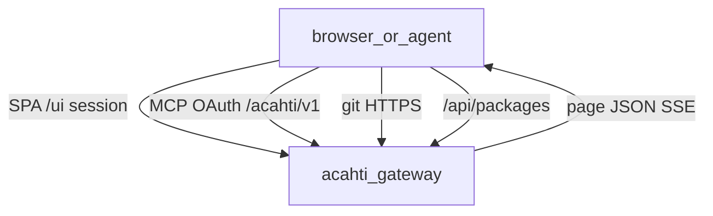
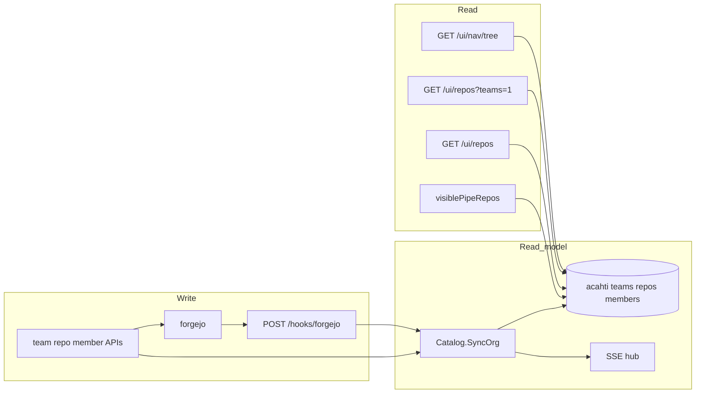
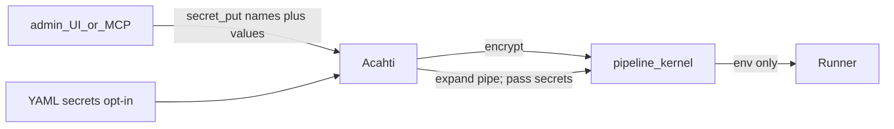
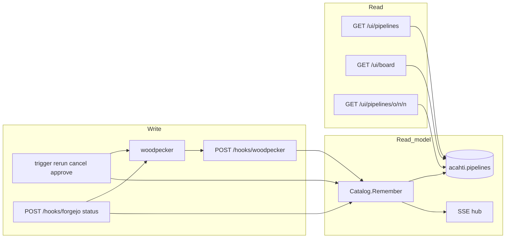
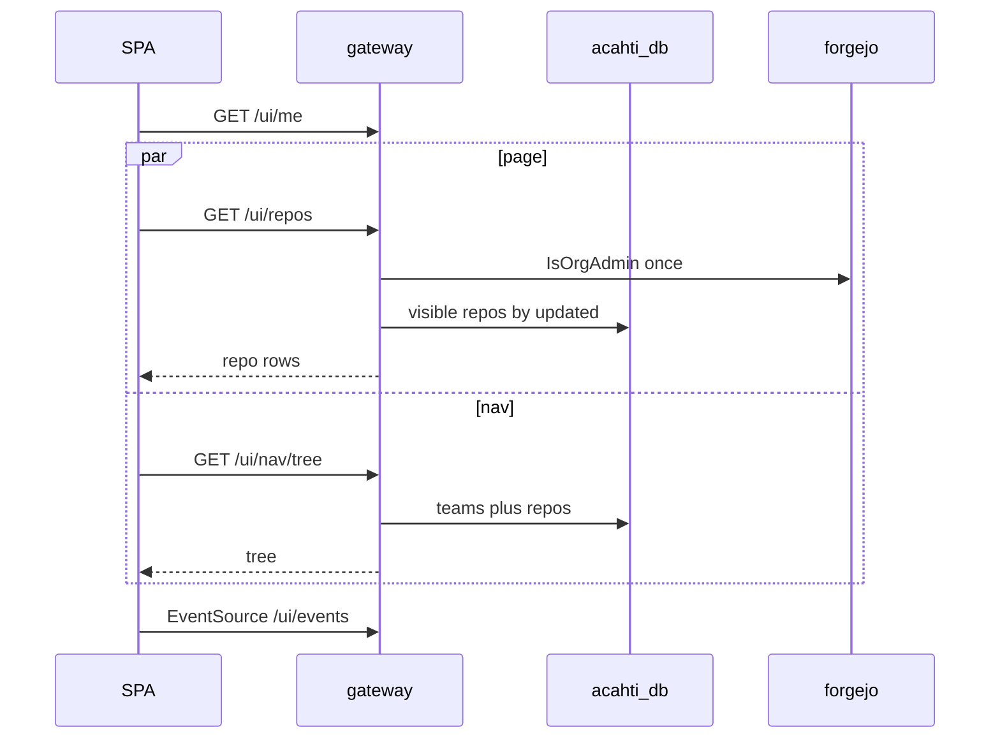

# Acahti architecture

Gateway is the only public HTTP app. People and coding agents never call internal kernels.

UI reads are a **read/write split** (local read models, not a Postgres replica):

| Surface | Read | Write |
|---|---|---|
| Pipeline runs | `acahti.pipelines` | pipeline kernel + webhook / mutation / backfill |
| Teams, repos, members, nav, ACL | `acahti` teams / repos / members | Acahti mutation write-through + git webhook + startup reconcile |
| Git contents, commits, PRs, packages, step logs | live kernel | those objects live in the kernel |

The git kernel remains the source of git objects, PRs, packages, and `.acahti/pipelines/` YAML on a **write or detail miss**. Gateway does not Walk the git kernel to assemble list, board, sidebar, or visibility.

## Stack

| Host | Runs |
|---|---|
| **Acahti** | control plane. No Runner on this host. |
| **Runner** | `ACAHTI_BUILD` — executes `.acahti/pipelines/` after Acahti expands `pipe:` |

Public identity is Acahti: SPA, MCP, `/acahti/v1`, git HTTPS, `/api/packages`. Closed to the internet: `/ci`, git-kernel HTML, `/api/v1`.

## Pipes

A pipeline file in `.acahti/pipelines/` is a **job**. A **pipeline** run contains those jobs; each job has **steps**. A **pipe** is an official reusable step (`pipe: helm@v1` + `with:`). Acahti expands those steps; the Runner runs `acahti-pipe`. See [pipes.md](pipes.md).

## Public surface

| Path | Who | Backend |
|---|---|---|
| `/ui/*` | people (cookie) | catalog BFF |
| `/mcp`, `/acahti/v1` | agents (OAuth) | same catalog |
| `/{org}/{repo}.git` | git | reverse proxy → git kernel (admin token + `Sudo`) |
| `/api/packages/*` | package clients | reverse proxy → git kernel |
| `/hooks/*` | kernels | index upsert + SSE |
| `/api/v1/*`, `/ci/*` | — | 404 |

SPA and MCP share one `catalog.Catalog`. The browser does not assemble a page from kernel APIs.

## Org catalog read / write

A **team folder** (`team_repos`) is grouping in the nav. Git and UI visibility is a per-repo ACL: `repo_collaborators` ∪ `team_repos.granted`. Joining a team does not open every repo in that folder.

**Write**

1. Create/delete team, members → Forgejo, then upsert the index, publish `catalog.updated`. Move/attach repo only writes the folder row (`granted` stays false until Access grants it).
2. Access `PUT /ui/repos/{owner}/{name}/grant` sets `team_repos.granted` and Forgejo `AddTeamRepo` / `RemoveTeamRepo` for that one repo. Direct people stay `repo_collaborators`.
3. MCP `repo_create` upserts `repos` (and a folder `team_repos` if a team is set).
4. Forgejo `repository` / create / delete webhooks upsert or delete the repo row.
5. Startup **reconcile** walks org teams, members, collaborators, and team-repos. Folder links already in the index are kept. Forgejo team-repos that are not `granted` are removed so git matches the index; granted rows are `AddTeamRepo`d again. Then `ReplaceOrg`.

**Read**

- `GET /ui/nav/tree`, `GET /ui/repos?teams=1`, `GET /ui/repos`, `GET /ui/teams/{team}` members/repos, pipeline ACL: SQL only. Visible repos are direct collab or a `granted` team.
- `GET /ui/users` attaches this page’s `teams` and `repos` ACL (`UserRepoPermsMany`); the Users Repos menu does not N+1.
- Repo file browser / commits / PRs still `GetRepo` (git ACL + live metadata). Team label comes from `team_repos`.
- `IsOrgAdmin` still checks Forgejo Owners (memo 30s).

## Pipeline secrets

Secrets live on Acahti (SPA + MCP). The pipeline kernel encrypts values and injects them as env at job time. Acahti never stores values. The Runner has no credential files.

**Write**

1. Org Owners: `/admin/secrets` or `secret_put` `{scope: org}`.
2. Repo admins: `/repos/{owner}/{name}/secrets` or `secret_put` `{scope: repo, repo}`.
3. Non-admins get **404** (no tab, no names). Values are never returned, including to admins.

**Run**

YAML `secrets: [name]` or mapped `secrets: { ENV: name }`. Expander passes lists through and rewrites maps to `environment.from_secret`. Pipes read env (`DOCKER_PASSWORD`, `KUBECONFIG` document, `ACAHTI_PUBLISH_TOKEN`, …).

## Pipeline read / write

**Write (command)**

1. SPA/MCP calls trigger / rerun / cancel / approve → Woodpecker.
2. Gateway `Remember`s the pipeline: merge declared jobs from YAML, upsert `acahti.pipelines`, publish `pipeline.updated`.
3. Woodpecker progress also arrives as Forgejo `status` webhooks or `POST /hooks/woodpecker`. Same `Remember`.
4. Startup backfill lists Woodpecker runs per active repo and `Remember`s them.
5. `WatchPipelines` refreshes indexed `running` rows from Woodpecker. A running step whose log has not grown for 15m is `Cancel`ed (Woodpecker does not close a step when the process dies without a Done RPC).

**Read (query)**

1. `GET /ui/pipelines` — time-ordered runs (`created DESC`). Visibility from the org catalog. Rows use stored `jobs` (no YAML fetch).
2. Board blocked / failed — same table, `status` filter.
3. Detail — index row. Miss or in-flight (`running` / `pending` / `blocked`) → Woodpecker `GetPipeline` and write-back. `files[]` loads YAML on `(repo, commit)` cache miss.
4. Step log still hits Woodpecker (`GET …/log`).

## Page contracts

One screen, one JSON. The SPA renders fields; it does not walk kernels.

| Request | Returns |
|---|---|
| `GET /ui/pipelines` | page of runs with stored `jobs` |
| `GET /ui/pipelines/{owner}/{name}/{n}` | `{ pipeline, team, files }` — `pipeline.jobs[].steps` |
| `GET /ui/secrets` | org pipeline secret names (Owners) |
| `GET /ui/repos/{owner}/{name}/secrets` | repo pipeline secret names (repo admin) |
| `GET /ui/nav/tree` | `[{ team, repos }]` from the org catalog; trailing `{ team: "" }` is unassigned repos |
| `GET /ui/repos?teams=1` | team names and counts |
| `GET /ui/users` | page of users with `teams` and this page’s `repos` ACL |
| `GET /ui/events` | SSE: `pipeline.updated`, `catalog.updated`, or `forgejo` (PRs) |

Detail open still may hit Forgejo for YAML files and Woodpecker for a missing row or logs.

Live updates: `pipeline.updated` patches list/detail by `repo+number`. `catalog.updated` reloads the nav tree and repo lists. `forgejo` refreshes board PRs only.

## Why not hit Forgejo or Woodpecker from the browser

Runs live in Woodpecker, not Forgejo. Opening `/api/v1` or `/ci` would break “Acahti is the only public identity” and push N+1 into the browser.

The extra hop `browser → gateway → localhost kernel` is not the cost. The cost was assembling one page with many kernel calls. The indexes and page JSON remove that.

## Data on disk

`${ACAHTI_DATA}` bind mounts only. After data exists, never `compose down -v`.

| Volume | Contents |
|---|---|
| `postgres/` | `forgejo`, `woodpecker`, `acahti` |
| `forgejo/` | git + Forgejo state |
| `woodpecker/` | Woodpecker server state |
| `gateway/` | invites, OAuth clients |

`acahti.pipelines` keys `(repo, number)`. Org catalog: `repos`, `teams`, `team_repos` (folder + `granted`), `team_members`, `repo_collaborators`.

Gateway migrate is `CREATE TABLE IF NOT EXISTS` at process start. Existing hosts: `store.Open` creates database `acahti` if missing (init script only runs on an empty PG data dir).

## Release

This product repo is GitHub `lpythu/acahti`, `main` only. Bump `ACAHTI_VERSION`, push, `bash scripts/tag-release.sh` → tag `v$ACAHTI_VERSION` → host Actions → `scripts/up.sh` (compose + configure + copy `pipes/` onto `ACAHTI_BUILD`). Gateway image builds with `-mod=vendor` (the acahti host cannot reach `proxy.golang.org`).
