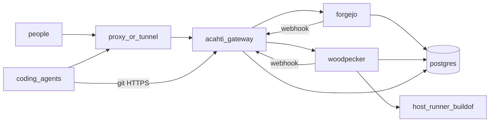
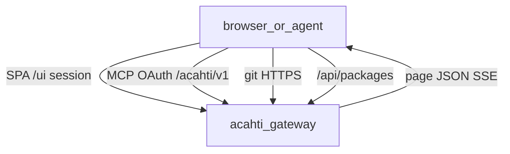
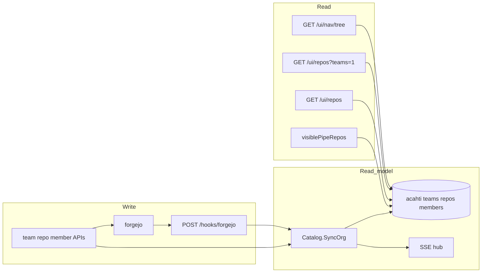
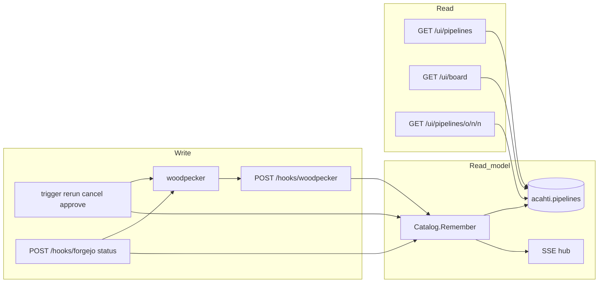
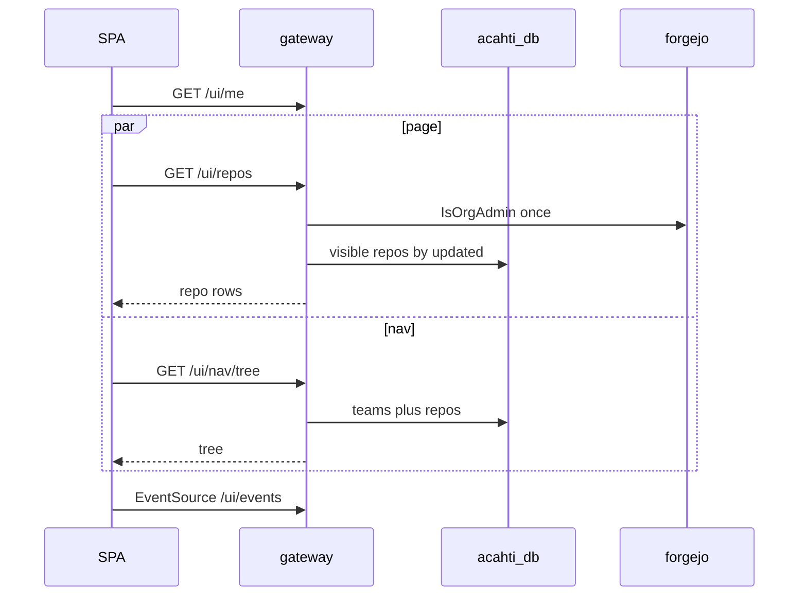

# Acahti architecture

Gateway is the only public HTTP app. Forgejo and Woodpecker stay on the compose network. People and agents never call those kernels.

UI reads are a **read/write split** (local read models, not a Postgres replica):

| Surface | Read | Write |
|---|---|---|
| Pipeline runs | `acahti.pipelines` | Woodpecker + webhook / mutation / backfill |
| Teams, repos, members, nav, ACL | `acahti` teams / repos / members | Acahti mutation write-through + Forgejo webhook + startup reconcile |
| Git contents, commits, PRs, packages, step logs | live kernel | those objects live in the kernel |

Forgejo remains the source of git objects, PRs, packages, and `.acahti/pipelines/` YAML on a **write or detail miss**. Gateway does not Walk Forgejo to assemble list, board, sidebar, or visibility.

## Stack

One Postgres, three databases: `forgejo`, `woodpecker`, `acahti`. Gateway never `SELECT`s the kernel databases.

| Host | Runs |
|---|---|
| **acahti** | gateway, Forgejo, Woodpecker server, Postgres. No Woodpecker agent. |
| **buildof** | one `woodpecker-agent` (`ROLE=both`) |

Public identity is Acahti: SPA, MCP, `/acahti/v1`, git HTTPS, `/api/packages`. Closed to the internet: `/ci`, Forgejo HTML, `/api/v1`.

## Public surface

| Path | Who | Backend |
|---|---|---|
| `/ui/*` | people (cookie) | catalog BFF |
| `/mcp`, `/acahti/v1` | agents (OAuth) | same catalog |
| `/{org}/{repo}.git` | git | reverse proxy → Forgejo (admin token + `Sudo`) |
| `/api/packages/*` | package clients | reverse proxy → Forgejo |
| `/hooks/woodpecker`, `/hooks/forgejo` | kernels | index upsert + SSE |
| `/api/v1/*`, `/ci/*` | — | 404 |

SPA and MCP share one `catalog.Catalog`. The browser does not assemble a page from kernel APIs.

## Org catalog read / write

**Write**

1. Create/delete team, members, attach repo → Forgejo, then upsert the index, publish `catalog.updated`.
2. MCP `repo_create` upserts `repos` (and `team_repos` if a team is set).
3. Forgejo `repository` / create / delete webhooks upsert or delete the repo row.
4. Startup **reconcile** walks org teams, members, and repos once and `ReplaceOrg`s the tables.

**Read**

- `GET /ui/nav/tree`, `GET /ui/repos?teams=1`, `GET /ui/repos`, `GET /ui/teams/{team}` members/repos, pipeline ACL: SQL only.
- Repo file browser / commits / PRs still `GetRepo` (git ACL + live metadata). Team label comes from `team_repos`.
- `IsOrgAdmin` still checks Forgejo Owners (memo 30s).

## Pipeline read / write

**Write (command)**

1. SPA/MCP calls trigger / rerun / cancel / approve → Woodpecker.
2. Gateway `Remember`s the pipeline: merge declared jobs from YAML, upsert `acahti.pipelines`, publish `pipeline.updated`.
3. Woodpecker progress also arrives as Forgejo `status` webhooks or `POST /hooks/woodpecker`. Same `Remember`.
4. Startup backfill lists Woodpecker runs per active repo and `Remember`s them.
5. `WatchPipelines` refreshes indexed `running` rows from Woodpecker. A running step whose log has not grown for 15m is `Cancel`ed (Woodpecker does not close a step when the process dies without a Done RPC).

**Read (query)**

1. `GET /ui/pipelines` — time-ordered runs (`created DESC`). Visibility from the org catalog. Rows use stored `jobs` (no YAML fetch).
2. Board blocked / failed — same table, `status` filter.
3. Detail — index row. Miss or in-flight (`running` / `pending` / `blocked`) → Woodpecker `GetPipeline` and write-back. `files[]` loads YAML on `(repo, commit)` cache miss.
4. Step log still hits Woodpecker (`GET …/log`).

## Page contracts

One screen, one JSON. The SPA renders fields; it does not walk kernels.

| Request | Returns |
|---|---|
| `GET /ui/pipelines` | page of runs with stored `jobs` |
| `GET /ui/pipelines/{owner}/{name}/{n}` | `{ pipeline, steps, team, files }` |
| `GET /ui/nav/tree` | `[{ team, repos }]` from the org catalog; trailing `{ team: "" }` is unassigned repos |
| `GET /ui/repos?teams=1` | team names and counts |
| `GET /ui/events` | SSE: `pipeline.updated`, `catalog.updated`, or `forgejo` (PRs) |

Detail open still may hit Forgejo for YAML files and Woodpecker for a missing row or logs.

Live updates: `pipeline.updated` patches list/detail by `repo+number`. `catalog.updated` reloads the nav tree and repo lists. `forgejo` refreshes board PRs only.

## Why not hit Forgejo or Woodpecker from the browser

Runs live in Woodpecker, not Forgejo. Opening `/api/v1` or `/ci` would break “Acahti is the only public identity” and push N+1 into the browser.

The extra hop `browser → gateway → localhost kernel` is not the cost. The cost was assembling one page with many kernel calls. The indexes and page JSON remove that.

## Data on disk

`${ACAHTI_DATA}` bind mounts only. After data exists, never `compose down -v`.

| Volume | Contents |
|---|---|
| `postgres/` | `forgejo`, `woodpecker`, `acahti` |
| `forgejo/` | git + Forgejo state |
| `woodpecker/` | Woodpecker server state |
| `gateway/` | invites, OAuth clients |

`acahti.pipelines` keys `(repo, number)`. Org catalog: `repos`, `teams`, `team_repos`, `team_members`.

Gateway migrate is `CREATE TABLE IF NOT EXISTS` at process start. Existing hosts: `store.Open` creates database `acahti` if missing (init script only runs on an empty PG data dir).

## Release

This product repo is GitHub `lpythu/acahti`, `main` only. Bump `ACAHTI_VERSION`, push, `bash scripts/tag-release.sh` → tag `v$ACAHTI_VERSION` → host Actions → `scripts/up.sh`. Gateway image builds with `-mod=vendor` (the acahti host cannot reach `proxy.golang.org`).
